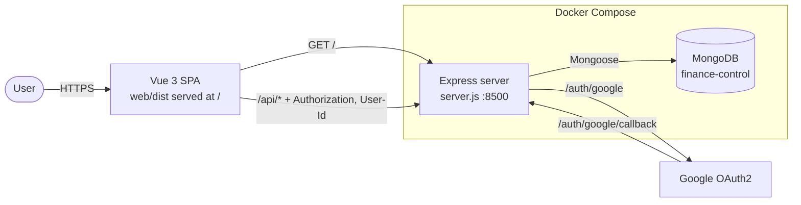
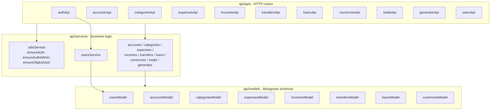
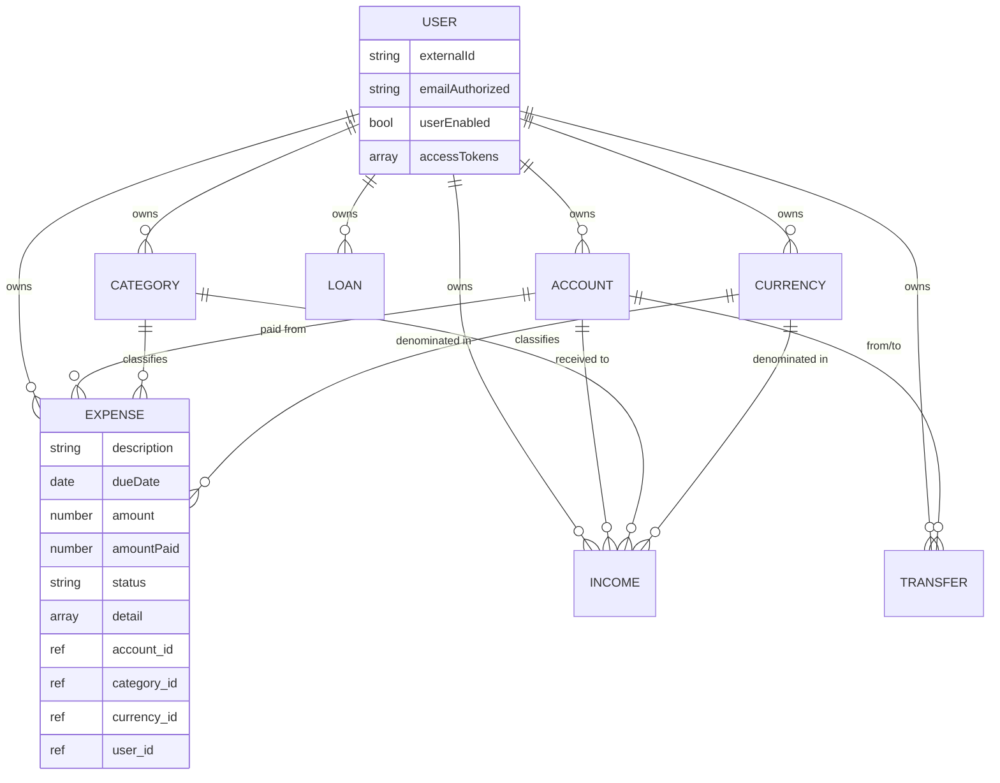
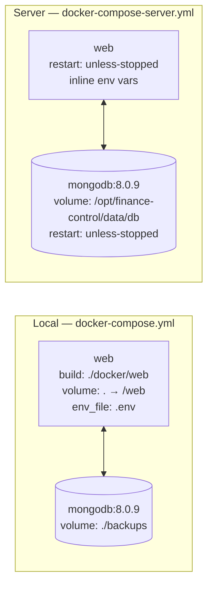
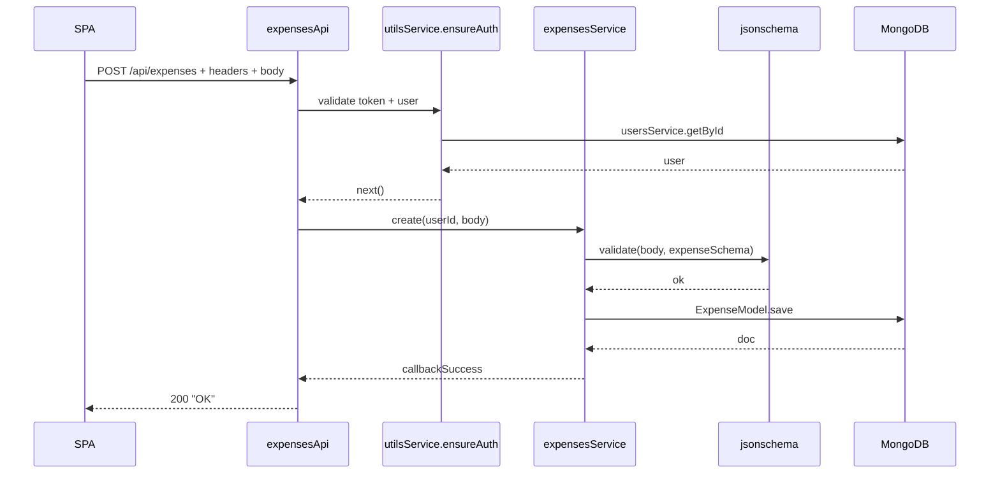

# Architecture

Personal finance tracker: expenses, incomes, transfers, loans, and balances across multiple accounts and currencies. Single-user-per-record model with Google OAuth login.

## Tech stack

| Layer       | Technology                                                                 |
| ----------- | -------------------------------------------------------------------------- |
| Runtime     | Node.js 18 (server) / 20 (web build)                                       |
| Backend     | Express 4, Mongoose 7, Passport (Google OAuth2), jsonschema                |
| Database    | MongoDB 8                                                                  |
| Frontend    | Vue 3 + Vite + PrimeVue (Aura) + Tailwind v4 + TypeScript                  |
| Packaging   | Docker / docker-compose                                                    |
| Auth        | Google OAuth2 → opaque access token in `Authorization` header              |

## High-level architecture



The Node process serves both the Vue SPA (built into `web/dist/`) and the JSON API from the same origin and port. The Vue build runs inside `docker/web/Dockerfile`'s multi-stage `web-builder` stage. Legacy `/app/*` URLs (the prefix used during the AngularJS → Vue migration) 302-redirect to the equivalent root path so old bookmarks keep working.

## Backend module layout

Three layers per resource (api → service → model). `server.js` only wires routes; everything else lives in those three folders.



Each `*Api.js` exports a function `(app, url) => { app.get/post/patch/delete(...) }` invoked from `server.js`. Domain services follow a uniform CRUD shape (`getById`, `get`, `create`, `edit`, `delete`) plus operation-specific methods (e.g. `expensesService.pay`, `incomesService.receive`). All services use Node-style `(callbackSuccess, callbackError)` callbacks rather than promises/async-await.

## Data model



Notes:
- Every domain document carries a `user_id`; ownership is enforced by `utilsService.ensureObjectUser` before mutating endpoints.
- `expense.detail` / `income.detail` are embedded line-item arrays, allowing a single transaction to split across categories.
- Accounts and categories use a soft-delete (active flag) rather than removing rows.

## Authentication flow

```mermaid
sequenceDiagram
    participant U as User
    participant SPA as Vue SPA
    participant API as Express
    participant G as Google OAuth2
    participant DB as MongoDB

    U->>SPA: Click "Entrar com Google"
    SPA->>API: GET /auth/google
    API->>G: Redirect with client_id, scope
    G-->>U: Consent screen
    U->>G: Approve
    G->>API: GET /auth/google/callback?code=...
    API->>G: Exchange code for profile
    API->>DB: usersService.logIn — upsert user, push new token
    API-->>SPA: Redirect to /#id&token&name&email&photo
    SPA->>SPA: consumeOAuthHash() stores in localStorage; router guard allows
    Note over SPA,API: All later requests carry<br/>Authorization: <token>, User-Id: <id>
    SPA->>API: GET /api/expenses (with headers)
    API->>API: utilsService.ensureAuth — verify user enabled<br/>+ token present in user.accessTokens
    API->>DB: query
    DB-->>API: rows
    API-->>SPA: JSON
```

Tokens are opaque random strings stored in an array on the user document, so multi-device sessions and revocation are both possible. Admin-only endpoints additionally check `emailAuthorized` against `USERS_API_ADMIN_EMAIL`.

## SPA structure

| Concern         | Location                                     |
| --------------- | -------------------------------------------- |
| Entrypoint      | `web/src/main.ts` (createApp + plugins, mounts `#app`) |
| Routing & guard | `web/src/router.ts` (HTML5 history at `/`, `meta.public`; calls `consumeOAuthHash()` at module load, before `createWebHistory`) |
| Views           | `web/src/views/*.vue` + `views/<resource>/<Resource>FormDialog.vue` |
| Composables     | `web/src/composables/*.ts` (CRUD wrappers, theme, isMobile, ...) |
| API client      | `web/src/lib/api.ts` (axios + auth interceptor) |
| Session         | `web/src/lib/session.ts` (`getSession`, `isLoggedIn`, `consumeOAuthHash`) |
| Navbar          | `web/src/components/AppNavbar.vue`           |
| Theme + locale  | `web/src/primevue.ts`                        |

Vue Router routes mirror the backend resources (`/expenses`, `/incomes`, `/accounts`, `/categories`, `/transfers`, `/loans`) plus `/`, `/login`, `/logoff`. The router's global `beforeEach` redirects unauthenticated requests to `/login` (routes flagged `meta.public: true` are exempt). The axios response interceptor calls `window.location.assign('/login')` on 401 from any API call.

## Deployment



The two compose files diverge on three things: env source (`.env` file vs inline), source-code mounting (dev mounts the repo for live reload; prod uses the baked image), and Mongo persistence path. Both wire the services on a `fc-network` bridge.

## Request shape

Most endpoints follow the same pattern, e.g. `POST /api/expenses`:



## Folder map

```
finance-control/
├── server.js                  # Express bootstrap, route registration, root SPA fallback, /app/* legacy redirect
├── package.json               # Node 18+, no test scripts; build:web shortcut
├── docker-compose.yml         # local dev (web + web-frontend Vite + mongodb)
├── docker-compose-server.yml  # production
├── docker/web/Dockerfile      # multi-stage: web-builder builds web/dist, runtime stage serves
├── api/
│   ├── apis/                  # 11 route modules
│   ├── services/              # 11 service modules (incl. utilsService)
│   └── models/                # 8 Mongoose schemas
├── web/
│   ├── package.json           # Vue 3, PrimeVue 4, Tailwind v4, Vite, TypeScript
│   ├── .npmrc                 # package-lock=false (Tailwind v4 / npm bug #4828)
│   ├── vite.config.ts         # base '/', proxies /api + /auth to Express
│   ├── index.html
│   ├── public/                # favicon, etc. (copied to /dist at build time)
│   └── src/
│       ├── main.ts            # createApp + plugins, mounts #app
│       ├── App.vue            # AppNavbar + Toast + ConfirmDialog + RouterView
│       ├── router.ts          # routes + auth guard; calls consumeOAuthHash() before createWebHistory
│       ├── primevue.ts        # theme + pt-BR locale
│       ├── lib/               # api.ts (axios), session.ts, dateUtils.ts
│       ├── components/AppNavbar.vue
│       ├── views/             # one View per resource + LoginView/LogoffView
│       └── composables/       # CRUD wrappers + theme/isMobile helpers
└── backups/                   # mounted into the Mongo container
```

## Observations and improvement opportunities

Worth raising before any rework:

1. **Tokens in `localStorage`.** Vulnerable to XSS exfiltration. `httpOnly` cookies + CSRF token would be a stronger default.
2. **Callback-based services.** The whole `api/services` layer predates async/await; converting to promises would simplify error handling and remove the deeply nested `callbackSuccess`/`callbackError` argument lists.
3. **Access tokens stored hashed but compared linearly.** `usersService.getUserTokenIndex` walks the `accessTokens` array calling `passwordHash.verify` on every entry, which is O(n) bcrypt-style verifies per request. For a heavy user this is wasteful; an opaque random string indexed directly (or a JWT) would be both cheaper and simpler.
4. **No tests, no CI, no linter.** `npm start` is the only script. A small Jest/Vitest suite around services and a basic GitHub Actions workflow would be high-leverage.
5. **No rate limiting or input sanitization beyond schema.** `express-rate-limit` and `helmet` would close obvious gaps.
6. **Single hard-coded admin** (`USERS_API_ADMIN_EMAIL`). A `role` field on the user document scales better than an env var.
7. **No API documentation.** Endpoint contracts live only in code; an OpenAPI spec (or at least a README of routes) would help any future client work.
8. **Mixed locale.** Status enums are in Portuguese (`Em aberto`, `Pago`) while route names are English; worth standardising.
