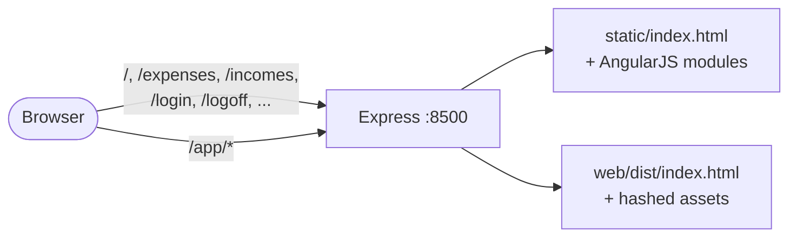

# UI migration: AngularJS → Vue 3

This document is the playbook for migrating the legacy AngularJS frontend to Vue 3, one screen at a time. Read [ARCHITECTURE.md](./ARCHITECTURE.md) first for the overall system context.

## Goal

Replace the AngularJS 1.x + Bower + Bootstrap 3 + ui-grid stack with Vue 3 + Vite + PrimeVue + Tailwind, without breaking the running app. We use the **strangler pattern** so the old and new apps coexist while screens migrate over.

## Current state

| Screen        | Status      |
| ------------- | ----------- |
| Categories    | ✅ Migrated  |
| Accounts      | ⏳ AngularJS |
| Expenses      | ⏳ AngularJS |
| Incomes       | ⏳ AngularJS |
| Transfers     | ⏳ AngularJS |
| Loans         | ⏳ AngularJS |
| Home          | ⏳ AngularJS |
| Login / Logoff | ⏳ AngularJS (auth source of truth) |

## Tech choices

| Concern             | Choice                                                          |
| ------------------- | --------------------------------------------------------------- |
| Framework           | Vue 3 (Composition API) + TypeScript                            |
| Build               | Vite, output to `web/dist/`, base path `/app/`                  |
| Component library   | PrimeVue 4, styled (Aura Light theme)                           |
| Styling             | Tailwind v4 utilities for layout/spacing only                   |
| Icons               | PrimeIcons (no Font Awesome in the new app)                     |
| Routing             | Vue Router (`createWebHistory('/app/')`)                        |
| State               | Composables for now; introduce Pinia only when state is shared across screens |
| HTTP                | axios instance with auth-bridge interceptor                     |
| Lockfile            | **Disabled** in `web/.npmrc` (`package-lock=false`) — see Gotchas |

## Strangler routing



Mount order in `server.js` is load-bearing — Express short-circuits on first match:

```js
app.use(express.static(__dirname + '/static'))           // legacy assets
app.use('/app', express.static(__dirname + '/web/dist')) // Vue assets
// ... /api/* routers ...
app.get(/^\/app(\/.*)?$/, (req, res) =>                  // Vue SPA fallback
  res.sendFile(__dirname + '/web/dist/index.html'))
app.use("/", (req, res) =>                               // legacy SPA fallback
  res.sendFile(__dirname + '/static/index.html'))
```

The Vue SPA fallback **must** come before the legacy catch-all, or `/app/foo` would return the AngularJS shell.

## Auth bridge

Until the login screen is migrated, AngularJS owns auth.

1. User logs in via Google OAuth (handled by AngularJS at `/`).
2. The OAuth callback redirects to `/#token=…&id=…&name=…&email=…&photo=…`.
3. AngularJS' `indexController` parses the hash and writes into `localStorage`.
4. The Vue app reads the same keys (`loggedUserToken`, `loggedUserId`, …) via `web/src/lib/session.ts`.
5. Every API call adds `Authorization: <token>` and `User-Id: <id>` headers via `web/src/lib/api.ts` (axios request interceptor).
6. On 401 from any API call, the response interceptor does `window.location.assign('/login')` — full page nav back to AngularJS.

If the login screen is migrated later, the OAuth callback target in `api/apis/authApi.js` must change from `/#…` to a Vue-owned route (e.g., `/app/login#…`).

## Navbar / cross-stack navigation

Both apps render their own navbar. Migrating a screen flips one link in each:

- **AngularJS navbar** (`static/index.html`): the link for the migrated screen changes from `<a ng-click="changeRoute('/x')">` to `<a href="/app/x">` — a plain anchor, full-page nav into Vue.
- **Vue navbar** (`web/src/components/AppNavbar.vue`): the migrated screen uses `<router-link to="/x">`. Unmigrated screens use plain `<a href="/x">` — full page nav back to AngularJS.

The user experiences a brief flicker on each cross-stack navigation. Acceptable for a personal app.

## Per-screen recipe

For each screen X (e.g., `Accounts`, `Expenses`, `Incomes`, `Transfers`, `Loans`, `Home`):

1. **Create Vue files** under `web/src/`:
   - `views/XView.vue` — the list/grid + toolbar + Toast + ConfirmDialog
   - `views/x/XFormDialog.vue` — the create/edit modal
   - `composables/useX.ts` — wraps the four typical CRUD calls against `/api/x`
2. **Register the route** in `web/src/router.ts`:
   ```ts
   { path: '/x', name: 'x', component: XView }
   ```
3. **Add `<router-link>`** in `web/src/components/AppNavbar.vue`. Move the entry from the `url:`-style legacy list to the `to:`-style migrated list.
4. **Flip the AngularJS navbar link** in `static/index.html`:
   ```html
   <!-- before -->
   <li><a href="" ng-click="changeRoute('/x')">…</a></li>
   <!-- after -->
   <li><a href="/app/x">…</a></li>
   ```
5. **Smoke test**: `npm run build:web && docker compose up --build`, then exercise the flow:
   - Direct deep link to `/app/x` works (SPA fallback).
   - Cross-stack nav works in both directions.
   - All CRUD operations succeed; toasts and validation messages match the legacy Portuguese copy verbatim.
6. **(Optional cleanup pass)** — once several screens have migrated, delete the orphan AngularJS controller, service, route registration, and HTML template for the migrated screens in a separate commit. Bower deps stay until *all* screens are migrated.

When the second screen needs **shared state** (typically a categories dropdown reused inside expenses/incomes forms), introduce **Pinia** at that point — not before.

## Component mapping cheat-sheet

| Legacy widget                         | PrimeVue replacement                                            |
| ------------------------------------- | --------------------------------------------------------------- |
| `ui-grid`                             | `DataTable` + `Column`, `selectionMode="single"`                |
| ui-grid footer aggregation            | `<DataTable>` `<template #footer>` slot                         |
| `uib-modal` (with templateUrl)        | `Dialog` with `v-model:visible`                                 |
| `confirmModal.html` pattern           | `ConfirmDialog` (singleton) + `useConfirm()`                    |
| `uib-alert`                           | `Toast` (singleton) + `useToast()`                              |
| Loading spinner overlay               | `ProgressSpinner` inside an absolutely-positioned overlay div   |
| AngularJS form validation (`required`, `ng-minLength`, `ng-maxLength`) | Computed `errors` map; mirror Portuguese messages literally |
| `ng-model` checkbox                   | `Checkbox` with `v-model` + `binary` prop                       |
| `select` with `ng-options`            | `Select` with `:options`                                        |
| Font Awesome (`fa-plus`, `fa-pencil`) | PrimeIcons (`pi pi-plus`, `pi pi-pencil`)                       |

## Build, dev, deploy

| Mode | Command | URLs |
| ---- | ------- | ---- |
| Dev (HMR) | `docker compose up --build` | Vue: `http://localhost:5173/app/<route>` (Vite, HMR)<br/>Legacy: `http://localhost:8500/` |
| Smoke test (integrated) | `npm run build:web && docker compose up --build` | Both apps at `http://localhost:8500/` |
| Production build | `npm run build:web && docker compose -f docker-compose-server.yml up --build` | Same single port |

Notes:
- The Express container does **not** build the Vue app. The `web/dist/` directory must be built on the host first; `npm run build:web` (in the repo root) is the shortcut. The Dockerfile then `COPY . .`'s the prebuilt `web/dist/` into the image.
- The `web-frontend` Vite dev container runs `npm install` against the bind-mounted `web/` on each `up`. Native bindings install correctly because there is no platform-pinned lockfile (see Gotchas).
- For HMR, hit the Vite port directly. Cross-origin localStorage means you must paste `loggedUserToken` and `loggedUserId` from `:8500`'s DevTools into `:5173`'s on first run.

## Gotchas (learned the hard way)

### Server-side schema requires every field on PATCH

`api/services/<resource>Service.js` validators use `jsonschema` with `required` arrays that include `user_id` (and other backend-injected fields). On `edit`, the frontend MUST send the full document with the edited fields overlaid — sending only the form fields returns 400.

The form-dialog pattern: load the full document on open, store it in a ref, and on submit return `{ ...loaded, ...editedFields }`. The legacy AngularJS code did this implicitly by mutating the `$scope.category` object.

### npm bug #4828: platform-pinned lockfiles break native bindings

Tailwind v4's `@tailwindcss/oxide` is a Rust-built native module. When `npm install` runs on macOS it generates a `package-lock.json` that records macOS-only optional deps. When Docker's Linux container reads that lockfile, npm skips installing the Linux binding and the build fails with `Cannot find native binding`.

Fix: `web/.npmrc` contains `package-lock=false`, so neither host nor container generates a platform-specific lockfile. Both resolve fresh against `package.json` semver ranges. We trade reproducibility for cross-platform correctness — acceptable for a personal project.

### Tailwind v4 needs Node 20+

`@tailwindcss/oxide@4.x` declares `engines.node: ">= 20"`. The Dockerfile and the `web-frontend` compose service both use `node:20`. Root `package.json` declares `"engines": { "node": ">=18" }` because the Express server itself runs fine on Node 18.

### Service worker can serve stale Vue assets

`static/serviceWorker.js` caches every GET response. After a `npm run build:web`, the hashed asset filenames change — without intervention, the SW would serve a stale `/app/index.html` referencing assets that no longer exist.

The fetch handler (line ~70) skips `/api/` and **`/app/`**, so Vue routes and assets always go to the network. When changing this file, also bump the `version` constant so old caches purge on next visit.

### Bind-mount + named-volume node_modules

`docker-compose.yml` bind-mounts the host `./web` to `/web` in both containers, with a named volume overlaid at `/web/node_modules` to keep Linux-installed deps isolated. After the named volume is initialized, the host's `web/node_modules` directory may appear empty — that's expected. Run `npm install` on the host once to repopulate when you need to build outside Docker.

If something goes wrong with the dev container's deps, nuke the volume and let it reinstall:

```bash
docker compose down
docker volume rm finance-control_web_frontend_node_modules
docker compose up --build
```

## File index

```
finance-control/
  server.js                          # Strangler routing for /app/*
  static/                            # Legacy AngularJS app (unchanged except navbar links)
  web/                               # Vue 3 app
    package.json
    vite.config.ts                   # base: '/app/', proxy /api → Express
    tsconfig.json
    .npmrc                           # package-lock=false
    index.html
    src/
      main.ts                        # PrimeVue + ToastService + ConfirmationService + Tooltip directive
      App.vue                        # Navbar + Toast + ConfirmDialog + RouterView shell
      router.ts                      # Vue Router with base '/app/'
      primevue.ts                    # Theme + pt-BR locale
      style.css                      # Tailwind directives + a few overrides
      lib/
        api.ts                       # axios + auth interceptor + 401 redirect
        session.ts                   # localStorage readers
      components/
        AppNavbar.vue                # PrimeVue Menubar; mix of router-links and legacy anchors
      views/
        CategoriesView.vue
        categories/CategoryFormDialog.vue
      composables/
        useCategories.ts
  docker/web/Dockerfile              # Single-stage; ships prebuilt web/dist/
  docker-compose.yml                 # Adds web-frontend Vite service (port 5173)
  .dockerignore                      # Excludes web/node_modules (NOT web/dist)
```
